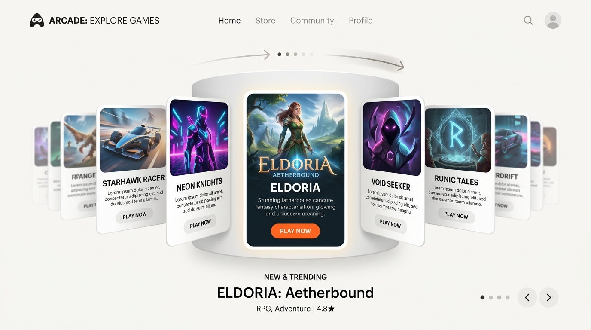
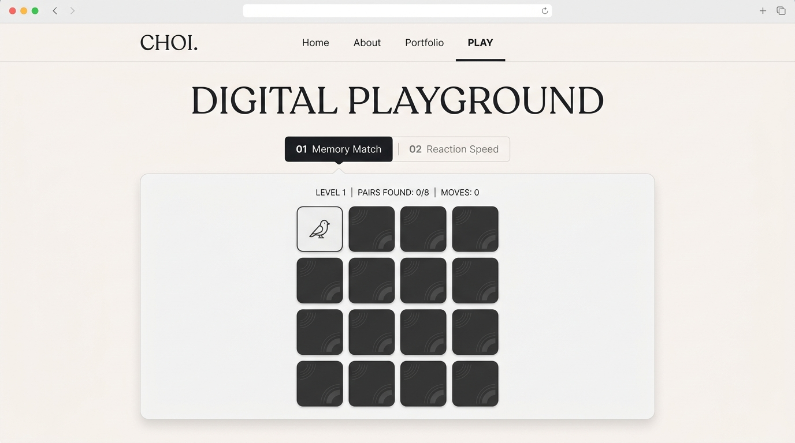

# [구현 계획서] 8-Game 3D 아케이드 회전문 및 전용 플레이 아레나

홈페이지(`index.html`)에 시각적 몰입감을 주는 **3D 파노라마 아케이드 회전문(Cover Arc Carousel)**을 구축하고, 개별 게임을 쾌적하게 즐길 수 있는 **독립형 게임 플레이 아레나(`play.html`)**를 구현하는 계획서입니다.

---

## 1. 프로젝트 배경 및 목적
* **목적**: 단순한 정적 웹사이트를 넘어 방문자가 직접 조작하고 즐길 수 있는 **인터랙티브 웹 경험(Interactive Web Experience)** 제공
* **핵심 컨셉**:
  1. 레트로 아케이드 오락실 느낌의 3D 입체 회전문 브라우징
  2. 원클릭으로 이동하여 게임에 온전히 몰입할 수 있는 전용 플레이 룸 분리

---

## 2. 화면 디자인 및 레이아웃 구상

### 3D 회전문 게임 허브 (메인 화면)

* **중앙 집중형 원통 궤도**: 가운데 위치한 카드가 가장 크고 선명하게 보이며, 양옆 카드는 원근감에 따라 축소 및 회전되는 파노라마 효과
* **직관적인 조작**: 좌우 화살표 버튼, 마우스 드래그, 모바일 터치 스와이프, 마우스 휠 지원

---

### 전용 게임 플레이 아레나 (`play.html`)

* **단일 페이지 동적 로딩**: `play.html?game=memory` 처럼 URL 쿼리 파라미터를 읽어 해당 게임을 화면에 즉시 렌더링
* **뒤로가기 편의성**: 언제든 홈 화면의 회전문으로 즉시 복귀할 수 있는 네비게이션 제공

---

## 3. 구현 대상 미니 게임 8종 (Mini Games)

| 번호 | 게임명 | 카테고리 | 게임 방식 |
| :---: | :--- | :--- | :--- |
| **01** | **Memory Match** | PUZZLE | 12장의 카드를 뒤집어 같은 짝을 모두 찾는 클래식 기억력 게임 |
| **02** | **Reaction Speed** | REFLEX | 빨간색 화면이 초록색으로 바뀌는 순간 클릭하여 반응 속도(ms) 측정 |
| **03** | **Tic-Tac-Toe** | STRATEGY | 스마트 AI를 상대로 3목을 먼저 완성하는 턴제 두뇌 대결 |
| **04** | **Up & Down** | LOGIC | 1~100 사이의 숨겨진 숫자를 7번의 기회 안에 UP/DOWN 힌트로 추리 |
| **05** | **Speed Clicker** | SPEED | 5초 동안 버튼을 광클하여 초당 클릭수(CPS)와 최종 점수 측정 |
| **06** | **Speed Typing** | WORD | 랜덤하게 제시되는 영어 단어를 제한 시간 내에 빠르게 입력하는 타자 게임 |
| **07** | **Color Match** | SENSE | 여러 개의 색상 블록 중 미세하게 채도가 다른 1개의 블록을 찾아내는 시각 게임 |
| **08** | **Sequence Memory** | MEMORY | 컴퓨터가 점등하는 4색 버튼 순서를 기억하고 똑같이 따라 누르는 시퀀스 게임 |

---

## 4. 시스템 구조 및 핵심 알고리즘

### 1) 3D 파노라마 수학적 모델링 (`getPanoramaOffsetStyle`)
* 기준점(중앙 카드 index = 0)으로부터 떨어진 거리(`offset`)에 따라 3차원 변환을 실시간 계산:
  - **X축 이동 (`translateX`)**: 카드가 겹치지 않고 부드러운 아치 곡선을 그리도록 비선형 간격 적용
  - **Z축 원근감 (`translateZ`)**: 중앙에서 멀어질수록 뒤로 깊숙이 배치
  - **Y축 회전 (`rotateY`)**: 중앙을 바라보도록 각도 적용
  - **크기 및 투명도 (`scale`, `opacity`)**: 외곽으로 갈수록 자연스럽게 페이드아웃

### 2) 사용자 인터랙션 및 모멘텀 물리 효과
* **1:1 실시간 드래그 트래킹**: 마우스를 움직이는 만큼 카드가 손끝을 따라 실시간 회전
* **모멘텀 스냅 (Momentum Snap)**: 손을 뗄 때의 드래그 속도(`dragVelocity`)를 측정하여 자연스럽게 다음/이전 카드로 부드럽게 안착

---

## 5. 단계별 실행 계획

1. **HTML 마크업**: `index.html`에 8개 카드 회전문 씬 구축 및 `play.html` 아레나 구조 작성
2. **3D CSS 스타일링**: `perspective`, `transform-style: preserve-3d`, 반응형 카드 크기 정의
3. **JS 코어 엔진**: 3D 회전문 수학 계산식 및 드래그 이벤트 리스너 작성
4. **8종 미니 게임 로직 개발**: 각 게임별 초기화, 점수 계산, 승패 판정 단일 함수 구현
5. **성능 최적화**: 60fps 부드러운 전환을 위한 불필요한 blur 제거 및 CSS transition 튜닝
