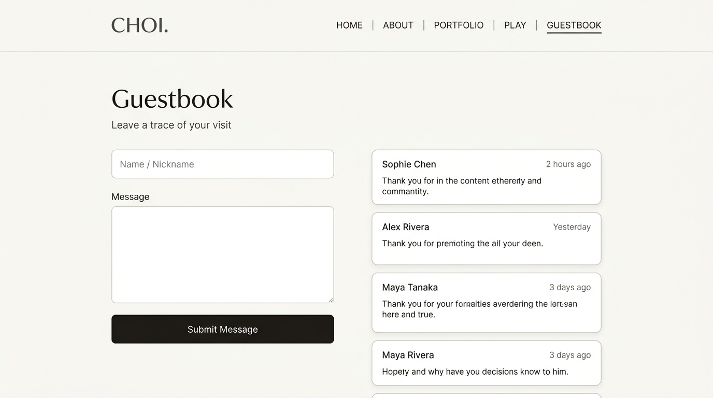
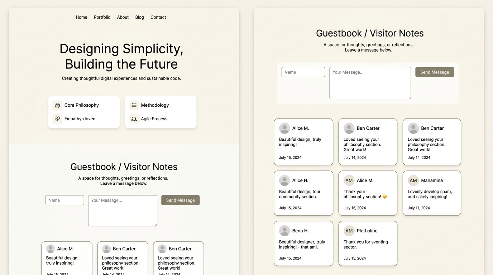

# [구현 계획서] Firebase Firestore 기반 방명록(Guestbook) 구현

Firebase의 NoSQL 데이터베이스인 **Cloud Firestore**를 활용하여, 방문자가 닉네임과 메시지를 남기고 실시간으로 확인할 수 있는 방명록 기능을 구현합니다.
기존에 생성되어 있는 프로젝트 **`first-firebase-f7450` (First-Firebase)**를 연동하여 사용할 예정입니다.

---

## 1. 디자인 및 레이아웃 옵션 비교

### 옵션 A: 독립 전용 페이지 (`guestbook.html`)
> 상단 메뉴에 `Guestbook` 메뉴를 추가하고, 독립된 페이지에서 방명록 작성과 목록을 집중도 있게 볼 수 있는 방식입니다.



* **장점**:
  - 기존 메인 페이지(`index.html`) 코드를 전혀 건드리지 않아 안정적입니다.
  - 방명록 글이 수십~수백 개로 늘어나도 메인 페이지 로딩 속도나 스크롤 길이에 영향을 주지 않습니다.
  - 전용 레이아웃(좌측 작성 폼, 우측 카드 피드)으로 시각적 완성도가 높습니다.

---

### 옵션 B: 메인 페이지 하단 연동 (`index.html` 내 섹션)
> 메인 화면에서 스크롤을 내리면 기존 콘텐츠 아래에 방명록 영역이 바로 나타나는 방식입니다.



* **장점**:
  - 방문자가 다른 페이지로 이동할 필요 없이 메인 화면에서 바로 글을 확인하고 남길 수 있어 접근성이 좋습니다.
* **고려사항**:
  - 메인 페이지 길이가 길어지며, 방명록 데이터가 많아질 경우 첫 화면 로딩에 약간의 영향을 줄 수 있습니다.

---

## 2. 요구사항 정의 (Requirements)

1. **방명록 작성 기능**
   - 방문자 닉네임(Name) 입력
   - 방명록 메시지(Message) 입력
   - 등록 버튼 클릭 시 Firestore에 저장
   - 빈 값 입력 방지 (간단한 유효성 검사 및 안내 메시지)
2. **방명록 목록 조회 기능**
   - 등록된 방명록 글 목록을 최신순으로 정렬하여 표시
   - 작성자, 작성 일시(날짜 및 시간), 내용 표시
3. **사용자 경험(UI/UX)**
   - 기존 웹사이트의 깔끔하고 미니멀한 톤앤매너(Pretendard 폰트, 오프화이트 `#fafaf9` 배경, 모던 카드 스타일) 유지
   - 전송 중일 때 중복 클릭 방지 (버튼 비활성화 및 안내 문구)
   - 모바일 및 PC 반응형 레이아웃 지원
4. **초보자 맞춤 코드 구조**
   - 직관적인 영어 변수명과 단일 기능 함수 사용
   - 복잡한 모듈 번들러 없이 HTML 내 `<script>` 태그를 통한 가장 단순한 연동

---

## 3. 시스템 구조 및 데이터 흐름 (Architecture)

```
[방문자 브라우저]
       │
       ├─ (1) 방명록 영역 로드
       │        ▼
       │      Firestore에서 방명록 데이터 불러오기 (`orderBy("createdAt", "desc")`)
       │        ▼
       │      화면에 카드 형태로 렌더링
       │
       └─ (2) 방명록 글 작성 후 '등록' 클릭
                ▼
              입력값 검증 (이름, 내용 필수)
                ▼
              Firestore `guestbook` 컬렉션에 새 문서(Document) 추가
                ▼
              화면 목록 즉시 갱신 및 입력창 초기화
```

### 데이터베이스 스키마 (`guestbook` 컬렉션)
* `nickname` (문자열): 작성자 이름
* `message` (문자열): 남긴 메시지 내용
* `createdAt` (Timestamp): 작성 일시 (정렬용)

---

## 4. 단계별 구현 계획 (Phases)

### 1단계: Firebase 웹 앱 설정값 확인 및 보안 규칙 설정
- `first-firebase-f7450` 프로젝트의 웹 앱 등록 및 SDK 설정값(`firebaseConfig`) 준비
- Firestore 읽기/쓰기 보안 규칙(Security Rules) 적용

### 2단계: 화면 마크업 및 스타일링
- 선택된 옵션(옵션 A의 경우 `guestbook.html` 신규 생성, 옵션 B의 경우 `index.html` 수정)
- `style.css`에 방명록 전용 미니멀 스타일 추가
- 네비게이션 링크 갱신

### 3단계: 자바스크립트 연동 (`guestbook.js`)
- `initializeFirebase()`: Firebase 앱 및 Firestore 초기화
- `loadGuestbookEntries()`: Firestore에서 글 목록 조회 및 렌더링
- `saveGuestbookEntry()`: 입력값 검증 후 Firestore 저장
- `formatDate()`: 작성 시간 보기 좋게 표시 (예: '2026. 09. 16 14:20')

### 4단계: 테스트 및 Git 커밋
- 실제 데이터 등록 및 실시간 목록 반영 테스트
- 변경 사항 정리 후 Git 커밋
