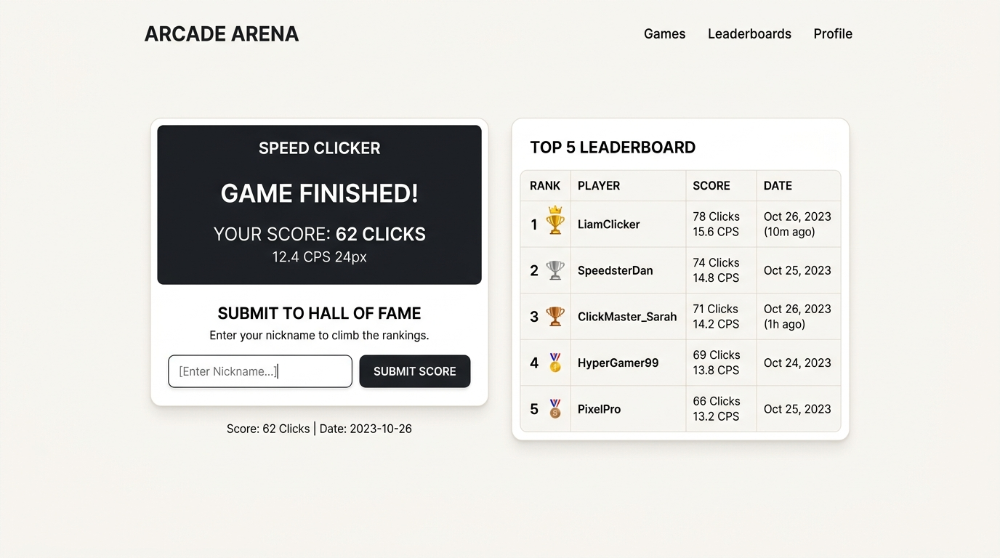

# [구현 계획서] 8-Game TOP 5 리더보드(명예의 전당) 시스템

Firebase Firestore를 활용하여 8가지 미니 게임의 **실시간 TOP 5 랭킹 시스템(명예의 전당)**을 구축합니다.
기존 게임 엔진과 메인 회전문 코드는 **100% 원본 그대로 보존**하며, 방명록처럼 독립된 모듈 방식으로 안전하게 개발합니다.

---

## 1. 핵심 안전 원칙 (기존 기능 완벽 보존)

1. **기존 게임 로직 무수정 원칙**:
   - `script.js`에 작성된 8가지 게임의 고유 알고리즘과 3D 회전문 수학 공식은 일체 변경하지 않습니다.
2. **독립 모듈화 (`leaderboard.js` 신규 생성)**:
   - 방명록이 `guestbook.js`로 분리되어 안전했던 것과 동일하게, 순위표 기능은 **새 파일 `leaderboard.js`**가 전담합니다.
3. **선택적 연동 (안전 훅 방식)**:
   - 각 게임이 끝났을 때만 외부 함수(`window.openLeaderboardSubmit(...)`)를 가볍게 호출하여, 설령 네트워크에 일시적인 장애가 있더라도 **게임 플레이 자체는 절대 멈추거나 튕기지 않도록 방어 설계**합니다.
4. **CSS 캐시 문제 원천 차단**:
   - 스타일시트에 `style.css?v=3.0` 버전 쿼리를 적용하여, 브라우저가 새 디자인을 즉시 다운로드받도록 보장합니다.

---

## 2. 화면 디자인 및 레이아웃 구상

### [미리보기 디자인]


### [플레이 아레나 화면 배치]
* **데스크톱 (2열 레이아웃)**:
  - 좌측: 선택한 게임의 플레이 무대 (기존과 동일)
  - 우측: 해당 게임의 **👑 TOP 5 명예의 전당 카드** (실시간 조회)
* **모바일 (반응형)**:
  - 상단: 게임 플레이 무대
  - 하단: TOP 5 순위표 카드

### [순위표 표시 요소]
* **1위**: 👑 금빛 왕관 트로피 + 골드 하이라이트
* **2위**: 🥈 은메달
* **3위**: 🥉 동메달
* **4, 5위**: 깔끔한 랭킹 번호
* 표시 항목: `순위` | `플레이어 닉네임` | `달성 기록(점수/시간)` | `달성 일자`

---

## 3. 게임별 순위 산정 기준 (8종 게임)

| 게임 ID | 게임명 | 순위 기준 | 정렬 방식 | 표시 형식 예시 |
| :--- | :--- | :--- | :---: | :--- |
| `clicker` | 5초 스피드 연타 | 클릭 횟수 | **내림차순 (높은 순)** | `62회 (12.4 CPS)` |
| `reaction` | 반응 속도 측정 | 반응 시간 (ms) | **오름차순 (낮은 순)** | `214 ms` |
| `memory` | 카드 짝 맞추기 | 뒤집은 횟수 | **오름차순 (낮은 순)** | `14회 만에 클리어` |
| `updown` | 업다운 숫자 맞추기 | 맞춘 시도 횟수 | **오름차순 (낮은 순)** | `3회 만에 정답` |
| `rps` | 가위바위보 | 최고 연승 수 | **내림차순 (높은 순)** | `8연승` |
| `mole` | 미니 두더지 잡기 | 잡은 마리 수 | **내림차순 (높은 순)** | `28마리` |
| `tictactoe` | 스마트 틱택토 | AI 상대 승리 | **내림차순 (높은 순)** | `승리 (3x3)` |
| `dice` | 주사위 대결 | 연승/승리 횟수 | **내림차순 (높은 순)** | `5승` |

---

## 4. 데이터베이스 및 보안 규칙 (`leaderboards`)

### Firestore 컬렉션 구조
* 컬렉션명: `leaderboards`
* 문서 데이터:
  - `gameId` (문자열): 게임 식별자 (예: `clicker`)
  - `nickname` (문자열): 1~15자 플레이어 이름
  - `score` (숫자): 순위 비교용 정량 수치
  - `scoreDisplay` (문자열): 화면에 보여줄 예쁜 텍스트 (예: `62회`)
  - `createdAt` (Timestamp): 달성 시간

### 보안 규칙 (`firestore.rules`)
```rules
match /leaderboards/{documentId} {
  allow read: if true;
  allow create: if request.resource.data.keys().hasOnly(['gameId', 'nickname', 'score', 'scoreDisplay', 'createdAt'])
                && request.resource.data.nickname.size() >= 1
                && request.resource.data.nickname.size() <= 15
                && request.resource.data.score is number;
  allow update, delete: if false; // 타인 기록 조작 방지
}
```

---

## 5. 단계별 실행 계획

1. **[1단계] 보안 규칙 및 Firestore 배포**
   - `firestore.rules`에 `leaderboards` 규칙 추가 및 Firebase 배포
2. **[2단계] 스타일링 및 레이아웃 확장**
   - `style.css` 끝에 리더보드 전용 카드/트로피 스타일 추가
   - `play.html`에 순위표 컨테이너 및 결과 등록 팝업 추가
   - CSS 캐시 버스팅 파라미터 적용 (`v=3.0`)
3. **[3단계] `leaderboard.js` 모듈 작성**
   - TOP 5 불러오기(`loadTopScores`) 및 신규 기록 저장(`saveScore`)
   - 게임 종료 시 자연스럽게 팝업되는 점수 등록 모달
4. **[4단계] 동작 검증, 브라우저 테스트 및 Git 커밋**
   - 기존 8개 게임이 이전과 똑같이 잘 되는지 하나씩 검증
   - 실제 기록 등록 후 1~5위가 메달과 함께 예쁘게 갱신되는지 확인
